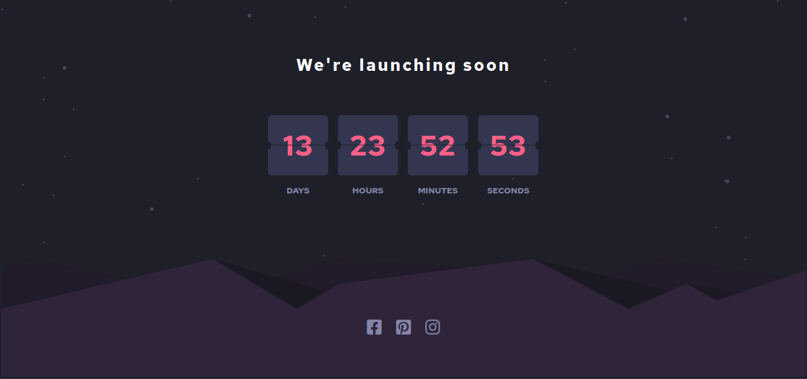

# Frontend Mentor - Launch countdown timer solution

This is a solution to the [Launch countdown timer challenge on Frontend Mentor](https://www.frontendmentor.io/challenges/launch-countdown-timer-N0XkGfyz-). Frontend Mentor challenges help you improve your coding skills by building realistic projects. 

## Table of contents

- [Overview](#overview)
  - [The challenge](#the-challenge)
  - [Screenshot](#screenshot)
  - [Links](#links)
- [Author](#author)

## Overview

*** 

### The challenge

Users should be able to:

- See hover states for all interactive elements on the page

- See a live countdown timer that ticks down every second (start the count at 14 days)

- **Bonus**: When a number changes, make the card flip from the middle

### Screenshot

Desktop view:

Mobile view:

### Links

- Solution URL: [here](https://github.com/kevst-dev/countdown-timer-Frontent-mentor)
- Live Site URL: [here](https://kevst-dev.github.io/countdown-timer-Frontent-mentor/)

## My process

***

### Built with

- Semantic HTML5 markup
- CSS custom properties
- Flexbox
- Desktop-first workflow
- Vanilla JS
- [Font Awesome](https://fontawesome.com)

## Author

***

- Website - [Add your name here](https://www.your-site.com)
- Frontend Mentor - [@yourusername](https://www.frontendmentor.io/profile/yourusername)
